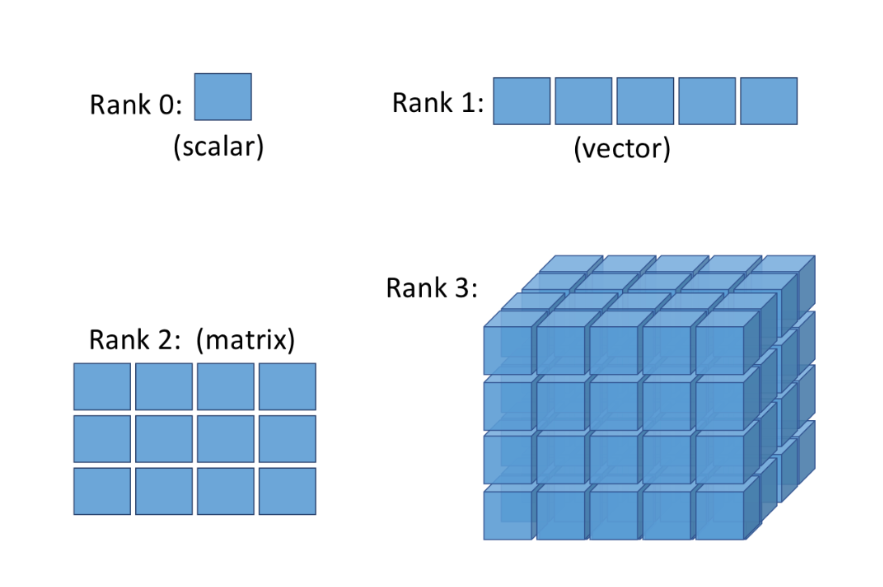
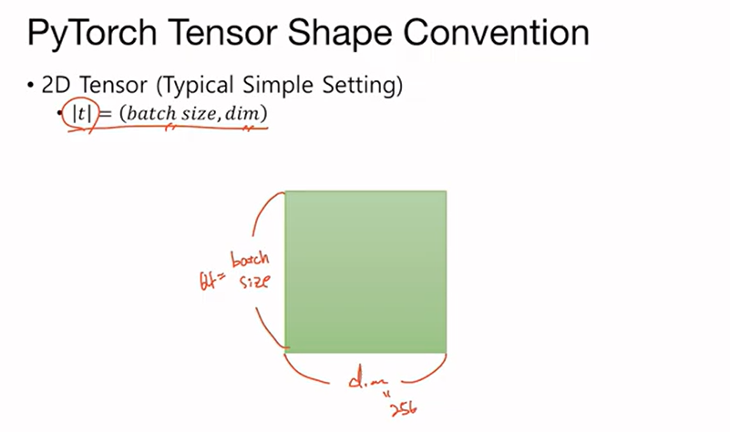

# PyTorch Basic Tensor Manipulation
Tensor는 데이터의 배열이라고 볼 수 있다.

> Scala, Vector, Matrix, Tensor


> 2D Tensor (Typical Computer Vision)
  
  - batch size란?

  한 번에 모델이 학습하는 데이터 샘플의 개수를 의미한다. 학습 데이터셋이 매우 클 경우, 전체 데이터셋을 한 번에 모델에 넣어 학습하는 것은 메모리와 계산적인 측면에서 불가능하다.

  >3D, 4D ... Tensor
  또한 Dimension이 확장되어 데이터를 구성하게 된다.

  ## 실습
  ### Array with Numpy
  ```python
  t = np.array([0., 1., 2., 3., 4., 5., 6.])
  t.ndim # rank = 1
  t.shape # shape = 7
```

### 1D Array with PyTorch
```python
t = torch.FloatTensor([0., 1., 2., 3., 4., 5., 6.])
t.dim() #rank = 1
t.size() #shape = 7
```
### 2D Array with PyTorch
```python
t =  torch.FloatTensor(
    [[1., 2., 3.], 
    [4., 5., 6.], 
    [7., 8., 9.], 
    [10., 11., 12.]])
print(t.dim())  # rank
print(t.size()) # shape
print(t[:, 1])
print(t[:, 1].size())
print(t[:, :-1])
# 2
# torch.Size([4, 3])
# tensor([ 2.,  5.,  8., 11.])
# torch.Size([4])
# tensor([[ 1.,  2.],
#         [ 4.,  5.],
#         [ 7.,  8.],
#         [10., 11.]])
```
### Broadcasting
행렬연산을 수행할 때는 기본적으로 행열의 크기가 같  거나 행의 크기가 같아야지 행렬곱이나 덧셈 등의 연산을 수행할 수 있다.

하지만 Broadcasting을 하여 크기가 다른 Tensor연산을 수행할 수 있다.
```python
# Vector + scalar
m1 = torch.FloatTensor([[1, 2]])
m2 = torch.FloatTensor([3]) # 3 -> [[3, 3]]
print(m1 + m2) # [[4,5]]
# ---2 x 1 Vector + 1 x 2 Vector---
m1 = torch.FloatTensor([[1, 2]])
m2 = torch.FloatTensor([[3], [4]])
print(m1 + m2)

tensor([[4., 5.],
        [5., 6.]])
```
### Matrix Multiplication & Multiplication

```

m1 = torch.FloatTensor([[1, 2], [3, 4]])
m2 = torch.FloatTensor([[1], [2]])

Matrix Multiplication 결과
tensor([[ 5.],
        [11.]])

dot product결과
tensor([[1., 2.],
        [6., 8.]])
```
### 여러가지 수학 함수
```
t = torch.FloatTensor(
    [[1, 2],
     [3, 4]])
t.mean(dim)
t.sum(dim)
t.max(dim)[0] >> max값
t.max(dim)[1] >> argmax값
```

### view (numpy에서 reshape)
```python
t = np.array([[[0, 1, 2],
               [3, 4, 5]],

              [[6, 7, 8],
               [9, 10, 11]]])
ft = torch.FloatTensor(t)
print(ft.shape)
# torch.Size([2, 2, 3])
```
```python
print(ft.view([-1, 3]))
print(ft.view([-1, 3]).shape)
```
-1은 shape를 잘 모르겠는데, [?,3]크기로 다시 reshape를 하겠다는 의미로 
```python
tensor([[ 0.,  1.,  2.],
        [ 3.,  4.,  5.],
        [ 6.,  7.,  8.],
        [ 9., 10., 11.]])
torch.Size([4, 3])
```
### Squeeze
view함수와 비슷하지만, 그 dim이 1 인경우 element를 없애준다.

```python
ft = torch.FloatTensor([[0],[1],[2]])
print(ft.shape) # torch.size([3,1])
print(ft.squeeze().shape) # torch.size([3])
```
### Unsqueeze
squeeze함수를 거꾸로 한 것
```python
ft.unsqueeze(dim)

print(ft.unsqueeze(0))
print(ft.unsqueeze(0).shape)
# tensor([[0., 1., 2.]])
# torch.Size([1, 3])
```

### Type Casting
타입 변환
```python
lt = torch.LongTensor([1,2,3,4])
lt.float() # Type Casting

bt = torch.ByteTensor([True,False,False,True])
bt.float()
```
### Concatenate
배열 2개를 합친다.
```python
x = torch.FloatTensor([1,2],[3,4])
y = torch.FloatTensor([5,6],[7,8])

torch.cat([x,y], dim=0) # dim=0에 이어 붙임
torch.cat([x,y], dim=1)
```
### In-place Operation
```pyton
x = torch.FloatTensor([[1, 2], [3, 4]])
print(x.mul(2.))
print(x)
print(x.mul_(2.))
print(x)
```
tensor([[2., 4.],
        [6., 8.]])

tensor([[1., 2.],
        [3., 4.]])

tensor([[2., 4.],
        [6., 8.]])

tensor([[2., 4.],
        [6., 8.]])
### Scatter( for one-hot-Encoding)
```python
lt = torch.LongTensor([[0], [1], [2], [0]])
print('lt: ',lt)
print('lt shape: ', lt.shape)
one_hot = torch.zeros(4, 3) # batch_size = 4, classes = 3
one_hot.scatter_(1, lt, 1) # scatter(dim,index,src)
print(one_hot)
```
```
lt:  tensor([[0],
        [1],
        [2],
        [0]])
lt shape:  torch.Size([4, 1])
tensor([[1., 0., 0.],
        [0., 1., 0.],
        [0., 0., 1.],
        [1., 0., 0.]])
```