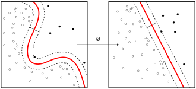
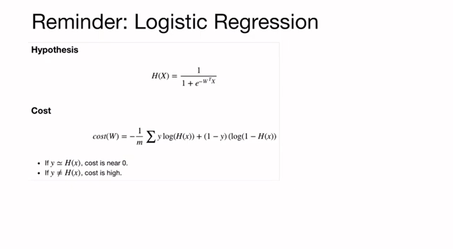
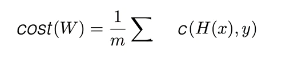
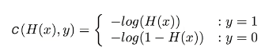
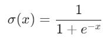
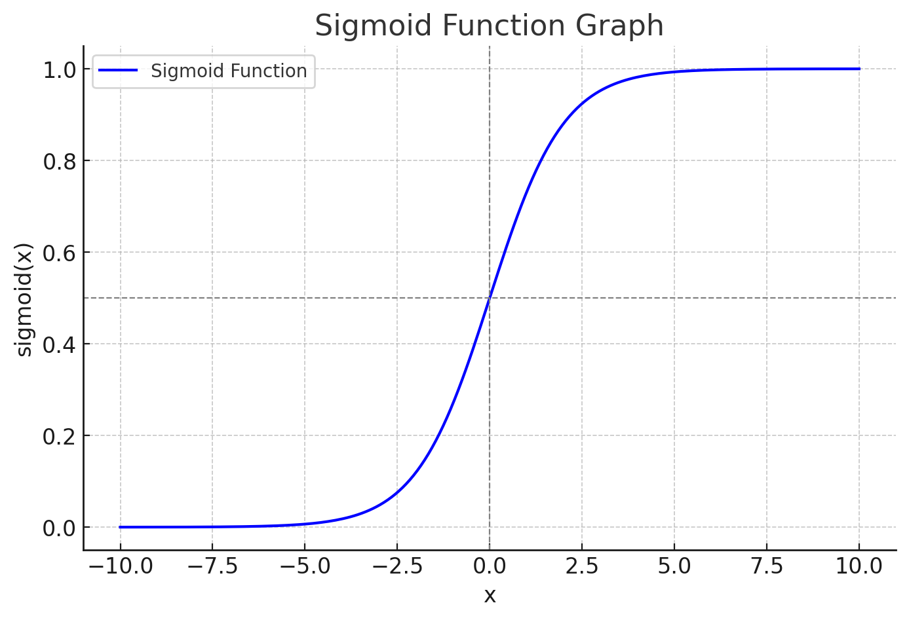
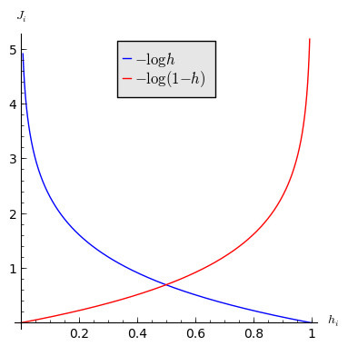
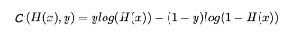
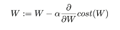

# [PyTorch] Lab-05 Logistic Regression
## 로지스틱 회귀란?

로지스틱 회귀는 **독립 변수**와 **종속 변수** 간의 관계를 파악하고, 이를 통해 미래의 결과를 예측하는 모델을 만드는 데 목적이 있습니다. 이 점에서는 **선형 회귀**와 비슷합니다.

그러나 로지스틱 회귀는 선형 회귀와 다르게 **종속 변수가 범주형 데이터**라는 점에서 차이가 있습니다. 즉, 결과가 어떤 *카테고리*에 속하는지 예측하는 것이죠.

### 예시
- 환자가 질병이 있는지 없는지 예측
- 이메일이 스팸인지 아닌지 분류

이처럼 결과가 둘 중 하나로 나뉘는 경우에 주로 사용되기 때문에, 로지스틱 회귀는 일종의 **분류 기법**이라고 할 수 있습니다.

> Cost Function of Logistic Regression

위의 Cost Function은 다음과 같이 식을 나눌 수 있다.

아래 그래프를 함께 보며 Cost Function을 이해해보자.
- Sigmoid Function Graph

- x: H(x)값
- σ(x): 출력 값, 0과 1 사이의 값으로 압축

실제 데이터의 결과 값인 y가 1일 때의 함수의 그래프를 그려보게 되면 예측 값이 1에 가까워질수록 Cost Function의 값은 0에 가까워진다. 

반대로 예측을 잘 못하여 0에 가까워질수록 Cost Function의 값이 무한대로 증가하게 되어 예측이 틀렸다는 것을 보여준다.

마찬가지로 *y = 0* 일 때도 같은 결과를 보여준다.

두 가지 식을 한번에 표현하면 아래와 같다.

Cost Function을 구한 이유는 이를 최소화 하여 가장 적절한 예측을 하게 하는 역할이다. 

따라서 **Gradient Descent Algorithm을 사용하여, W(가중치)를 업데이트 한다.

> Cost Function을 직접 미분하여 표현하여 수식으로 증명하는 것은 복잡한 과정이지만, Cost Function의 기울기를 계산하여 최소 값을 가지게 변화시키는 개념을 가지고 이해하면 쉽다.