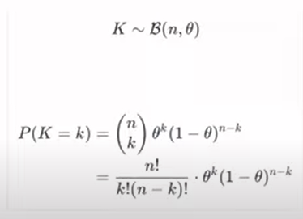
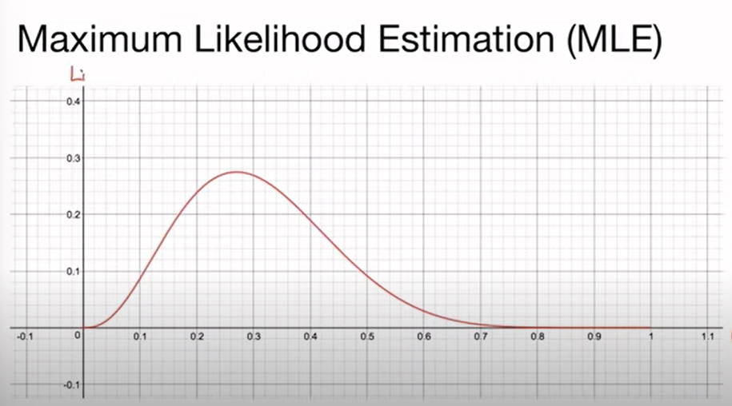
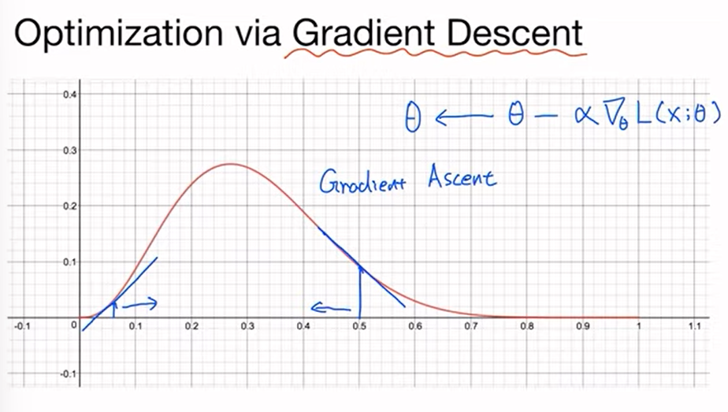
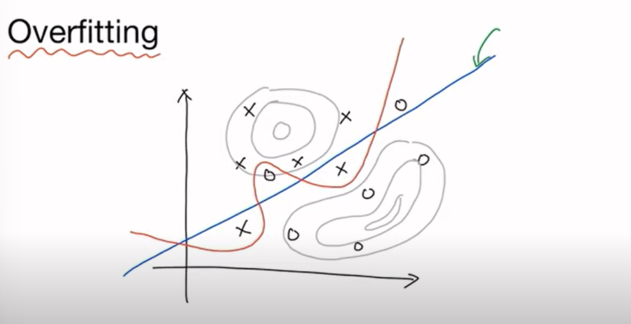
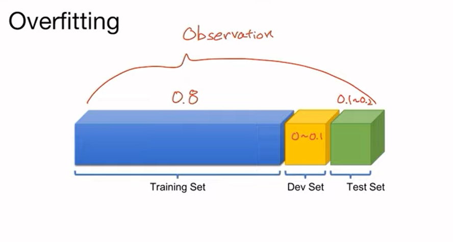
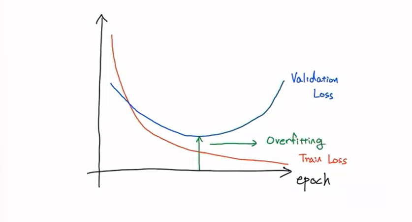
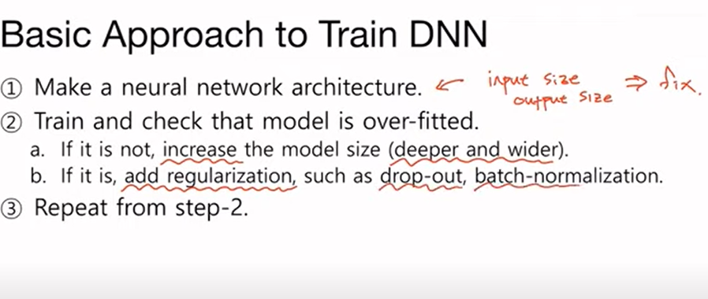

# Tips

## Maximum Liklihood Estimation(MLE) 최대 우도 추정법

베르누이 이항 분포

n = 시도, 
k = 사건 관찰 횟수

theta를 찾는 것이 인공지능

n = 100, k = 27 일때,
theta에 관한 그래프, 결국 theta에 관한 함수 f(theta)을 찾아야 한다.

Gradient Ascent를 통해 최적의 값을 찾는다.

## Overfitting

주어진 데이터에 과도하게 학습을 하게 되는 현상

Training Set: 학습에 이용되는 데이터

Dev Set, Validation Set: 검증에 이용되는 데이터 

Test Set: 모델을 Test하는 Set

Validation Set과 Test Set을 통해 overfitting을 줄일 수 있다.

## Overfitting 줄이는 법
1. 많은 데이터
2. feature 줄이기
3. Regularization

### Regularization
1. Early Stoppoing: Validation Loss가 더이상 낮아지지 않을 때 사용
2. Reducing Network Size: 파라미터 줄이기
3. Dropout
4. Batch Normalization

모델 성능 높이기

overfitting 발생 시, Regularization과 같은 방법 실행
아니면 모델을 더 깊고 넓게 설정.

