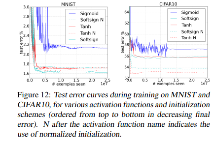
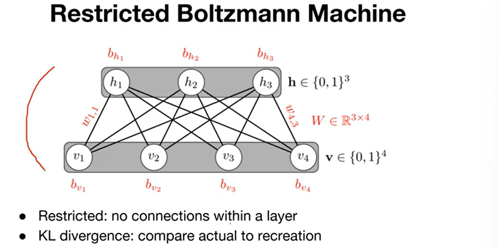
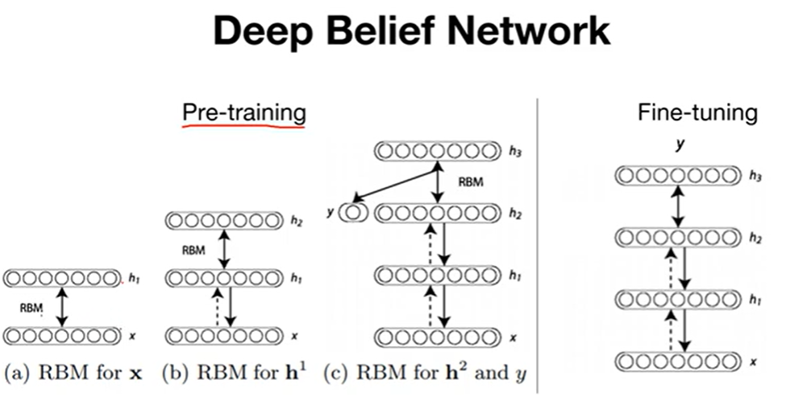
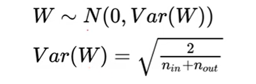
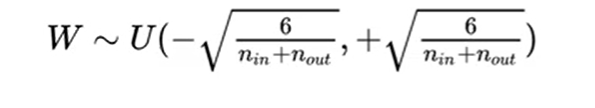
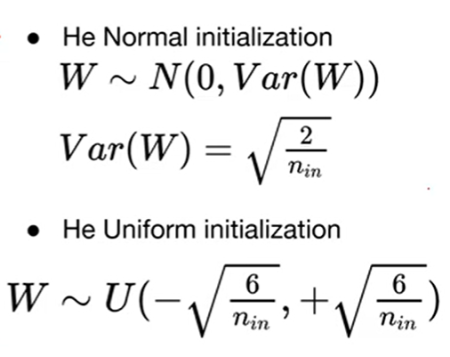
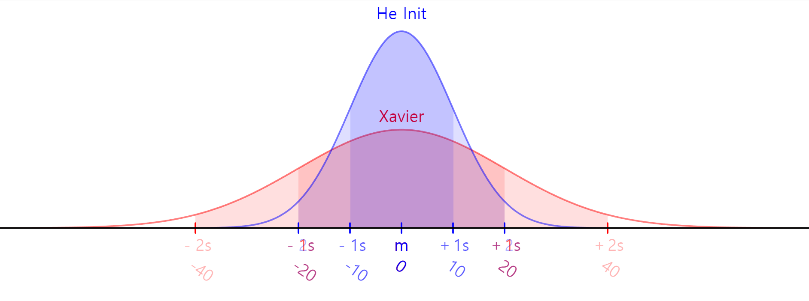

# Weight initialization

> 제프리 힌톤 왈

우리는 멍청한 방식으로 가중치를 초기화 하고 있었다

가중치를 잘 초기화 해야하는데 고정하고 사용하고 있었다.

가중치를 초기화하는 방법이 성능에 중요한 영향을 끼친다.

### Weight를 초기화 하는 방법
- 0이 아닌 값으로 한다.
- Restricted Boltzmann Machine(RBM)

> RBM이란?

서로같은 층에 있는 노드들은 연결이 되어 있지 않고 서로 다른 층과 연결되어 있는 구조를 말한다.또한 순방향 x > y 구조와 y > x' 을 하는 역방향 구조를 지닌다. 이는 인코딩 디코딩 구조와 비슷하다.

### 어떻게 RBM을 Weight Initialization 했을 까?
pre-training Step을 했다.

2개의 레이어를 RBM으로 학습을 시킨다. 층을 여러개 쌓을 경우 그 전의 weight는 고정 시킨다.

- 하지만 RBM은 요즘은 잘 사용하지 않는다. 복잡하고 다른 간단한 Weight Initialization이 있기 때문이다.

### Xavier/He Initialization

> Xavier
간단히 수식을 통해서 Weight를 초기화 하는 방법

- Xavier Normal Initialization

레이어의 input수와 ouput수를 통해 초기값을 구할 수 있다.

- Xavier Uniform Initialization

>He Initialization

## 그 밖에 Weight Initialization
### 전이 학습 (Transfer Learning)
전이 학습은 이미 대량의 데이터로 학습된 모델(소스 모델)의 지식을 다른 관련 작업(타깃 작업)에 적용하는 과정을 의미합니다. 이 방식은 특히 학습 데이터가 부족한 상황에서 유용하며, 기존에 학습된 모델이 축적한 지식을 활용하여 새로운 문제에 더 빠르고 효과적으로 접근할 수 있도록 합니다.
### 파인 튜닝 (Fine-Tuning)
파인 튜닝은 전이 학습의 한 형태로, 사전 훈련된 모델을 특정 작업이나 데이터셋에 맞추어 추가적으로 조정하는 과정입니다. 이 과정은 모델을 특정 작업에 더욱 정밀하게 맞추는 데 중점을 둡니다.

**초기 가중치 활용**

사전 훈련된 모델의 가중치를 시작점으로 사용하는 것은 파인 튜닝의 핵심입니다. 이 초기 가중치들은 이미 많은 일반적인 특징들을 학습한 상태이며, 이를 기반으로 새로운 데이터에 대한 학습을 보다 효율적으로 진행할 수 있습니다.

| 구분          | 전이학습(Transfer Learning)                                | 파인튜닝(Fine-Tuning)                                        |
|---------------|-----------------------------------------------------------|--------------------------------------------------------------|
| 목적          | 대규모 데이터셋에서 학습된 지식을 새로운 작업에 적용       | 사전 훈련된 모델을 특정 작업에 맞추어 추가 조정              |
| 핵심 과정     | 기존 모델의 지식을 새로운 문제에 전달                      | 기존 모델의 세부 사항을 새로운 문제에 최적화                 |
| 데이터 요구량 | 상대적으로 적음                                            | 상대적으로 적으나, 모델을 특정 작업에 맞게 조정 필요          |
| 적용 예시     | ImageNet으로 학습된 모델을 특정 동식물 분류에 적용          | 의료 영상 분석을 위해 일반 이미지 분류 모델을 조정            |
| 학습시간      | 새로운 학습보다 단축                                       | 사전 훈련된 모델을 기반으로 하므로 단축                      |
| 적합성        | 다양한 작업에 일반적인 모델 적용 가능                      | 매우 특정한 작업이나 데이터셋에 최적화 필요                  |
