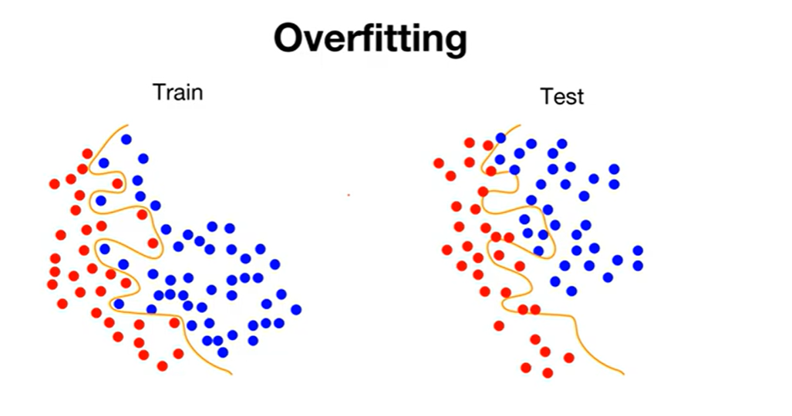
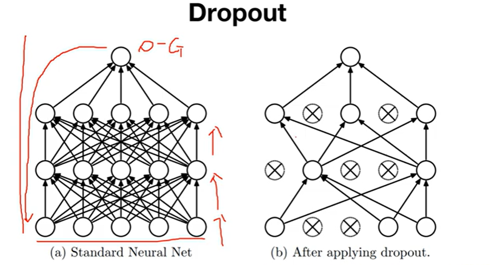
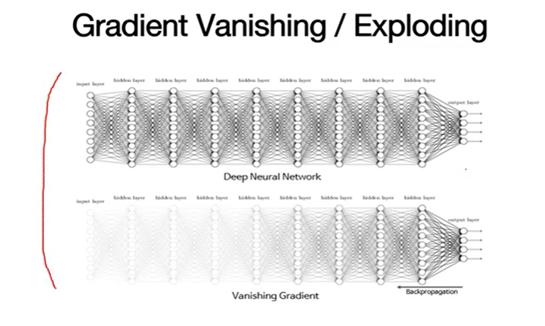
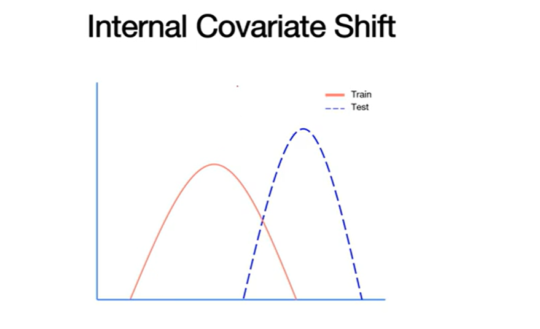
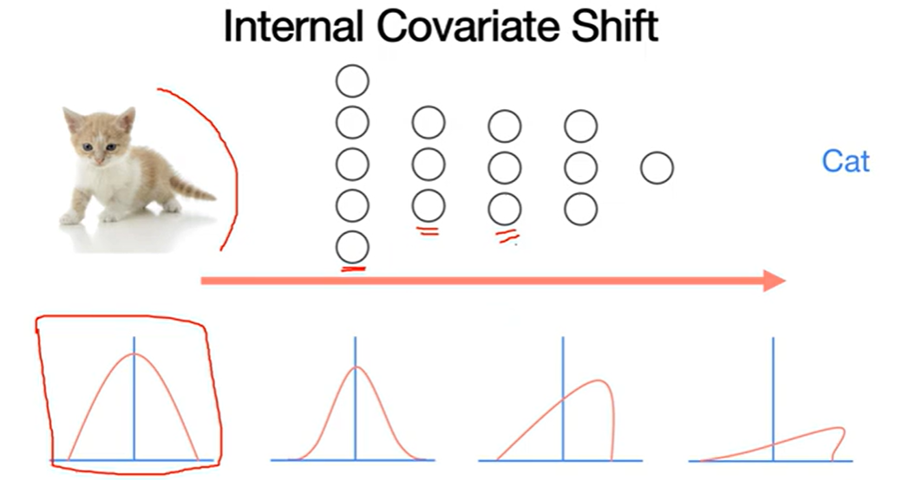
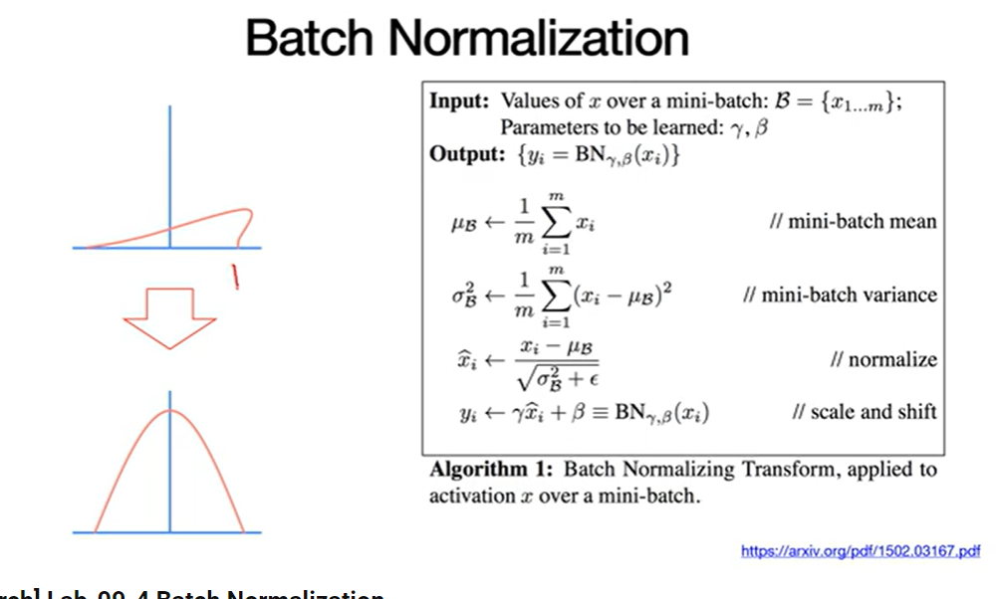

# Drop Out
Overfitting 방지를 위해 활용한다.

>Overfitting이란?

Train Data에 너무 잘 학습해 버려서, Test Data에서는 정확도가 낮은 현상

DropOut은 학습을 진행하면서 뉴런(노드)을 무작위 확률로 off 하고 학습하는 방법

# Batch Normalization

>Gradient Vanishing

Backpropagation 중에 미분값이 작아져서 앞 뉴런들이 소실되는 현상

> Gradient Exploding?
미분값이 너무 커져서    
Nane값이나 극대값을 갖는 현상

### Solution
- Change activation F
- Weight Initializaion
- Small Learning rate

## 또 다른 해결 방법: Batch Normalization

>Covariate Shift    
Train Set과 Test Set의 분포가 서로 다른 현상

**인공지능**에서 Internal Coavriate Shift는 Layer마다 데이터 분포가 달라지는 현상이다.

따라서 Layer가 지나고 Batch 데이터에 Normalization을 적용하여 분포를 맞춰준다.

