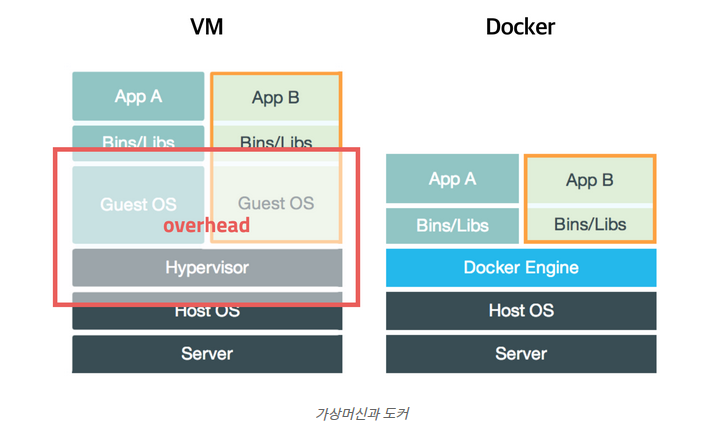
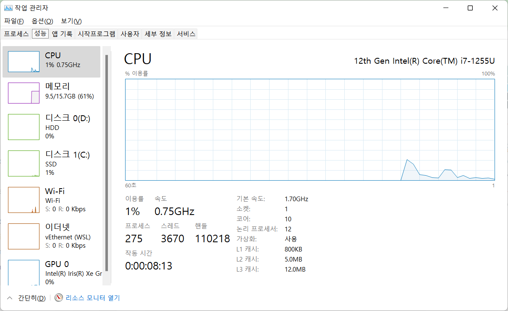
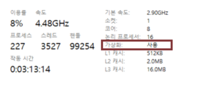
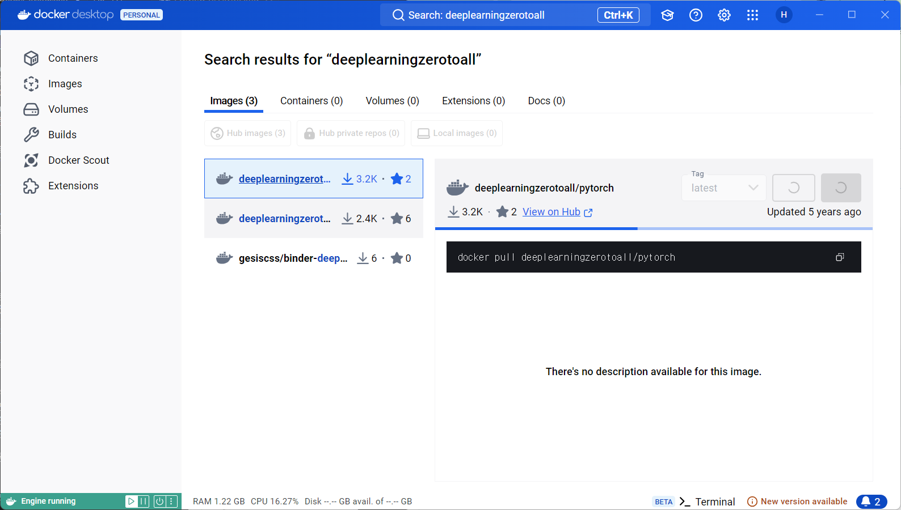
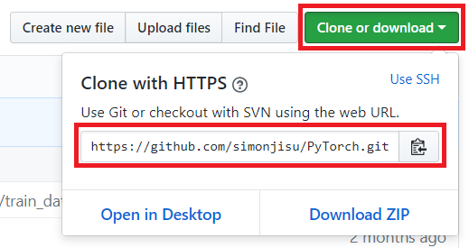
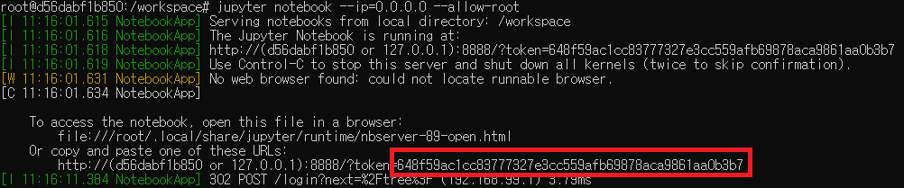
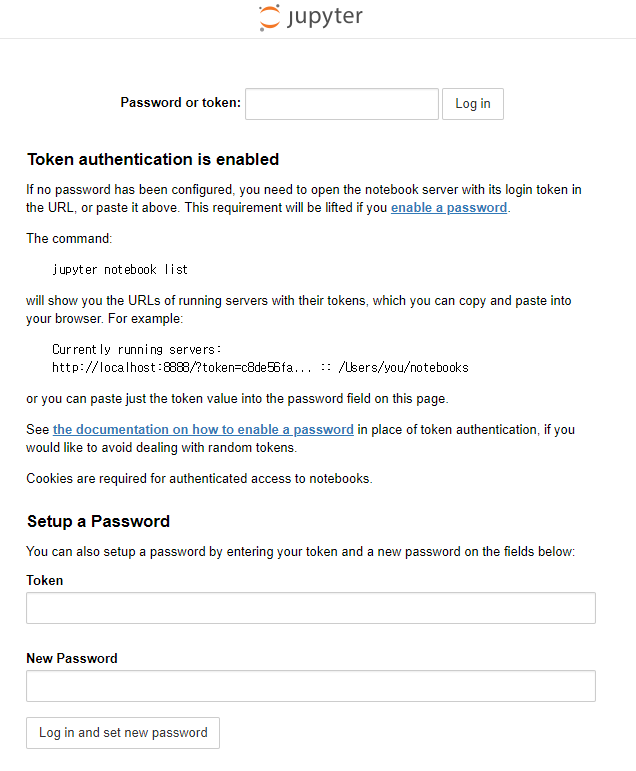

# Docker Instruction
컨테이너 기반의 오픈소스 가상화 플랫폼
## Docker란
Container-Based Virtualization System
Virtualization은 현실에 있지 않은 환경을 만들어 준다.
- 다양한 프로그램, 실행환경을 컨테이너로 추상화 하고 동일한 인터페이스를 제공하여 프로그램의 배포 및 관리를 단순하게 해준다.
- 백엔드 프로그램, 데이터베이스 서버, 메시지 큐등 어떤 프로그램도 Container를 추상화 할 수 있고, PC, AWS, Google Cloud등 어디에서든 실행가능

### Container
- 이전 방식 VMware 등은 사용법이 간단 하지만, 무겁고 느리다.
- CPU의 가상화 기술(HVM)를 이용한 반 가상화 방식 Xen을 사용
- 전체 OS를 가상화 하지 않고 Host OS를 가상화
- 하나의 서버에 여러 개의 Container 가능
- 이미지를 실행한 상태를 의미
### Image
- Container에 필요한 파일과 설정 값 등을 포함
- Image 안에 여러 개의 Container
- Docker hub을 통해 필요한 Image을 다운 가능
- 도커에 필요한 서버 프로그램, 소스코드, 실행 파일로 프로그램을 구동하기 위한 종합선물세트



## Docker 설치 가이드
- Docker 설치 전

먼저 컴퓨터 하드웨어가 가상화를 지원해야만 가능합니다. 그래서 작업 관리자(ctrl + alt + del)에 진입 후 성능에 들어가서 가상화를 확인할 수 있습니다.



- Docker 설치

[Docker Desktop for Windows](https://docs.docker.com/desktop/install/windows-install/)

위 링크를 통해 다운로드

- 설치 확인
cmd창에 아래 명령어로 확인
```
docker -v
```
## Docker 사용법
- Image 다운로드


혹은 cmd에
```
$ docker pull deeplearningzerotoall/pytorch
```
이미지를 받으셨으면 `docker images` 명령어를 쳐서 도커 이미지의 존재를 확인해봅니다.
```
$ docker images
REPOSITORY				TAG	...
hello-world				latest	... 
deeplearningzerotoall/pytorch		latest	...
```
### 도커 이미지로부터 컨테이너 실행하고 끄기
도커 이미지로부터 컨테이너를 생성하고 실행합니다. 이때 --name 뒤에 원하는 이름을 설정할 수 있습니다. 이번 가이드에서는 pt 로 하겠습니다.
```
docker run -i -t --name pt -p 8888:8888 -p 8097:8097 deeplearningzerotoall/pytorch /bin/bash
```
이제 거의 다 왔습니다. 도커 컨테이너를 만들었고 root 계정으로 컨테이너 내부 쉘에 접속한 상태입니다.

```
root@[고유번호]:~#
```

### 도커 컨테이너 자유롭게 드나들기
주의: docker run 명령어는 한번 만 실행하시면 됩니다. 종료된 컨테이너를 다시 실행하려면 아래와 같이 실행합니다.
```
docker start pt
```
이 단계는 컨테이너를 키기만 했을 뿐입니다. 컨테이너 터미널에 접속하려면 아래와 같이 실행합니다. 그러면 컨테이너 내부 터미널로 이동하게 됩니다.

```
docker attach pt
root@[고유번호]:~#
```

### 가상환경에 Git Clone 하기


```
git clone https://github.com/deeplearningzerotoall/PyTorch.git
```
```
root@[고유번호]:~# git clone https://github.com/deeplearningzerotoall/PyTorch.git
```
완료가 되면 이제 PyTorch 디렉토리로 이동합니다.
```
root@[고유번호]:~# cd PyTorch
root@[고유번호]:~/PyTorch# 
```
필수 패키지를 설치해줍니다.
```
root@[고유번호]:~/PyTorch# pip install --upgrade pip
root@[고유번호]:~/PyTorch# pip install -r requirements.txt
```
jupyter notebook을 실행합니다.
```
jupyter notebook --ip 0.0.0.0 --allow-root
```
jupyter notebook 처음 실행후 아래 이미지 처럼 도커 터미널에 긴 토큰이 생기는데 해당 토큰을 복사해둡니다


`127.0.0.1:8888` url을 통해 접속 후 복사한 토큰을 비밀번호로 입력.



go!!! PJT

