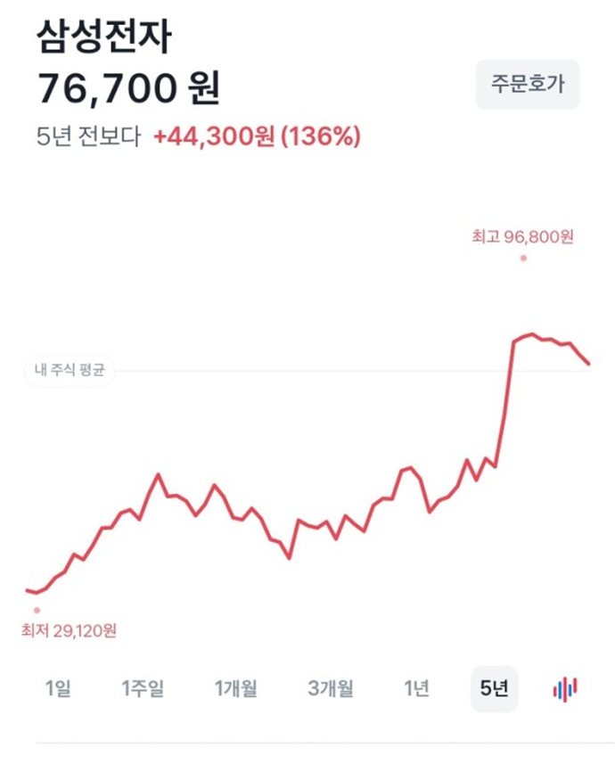
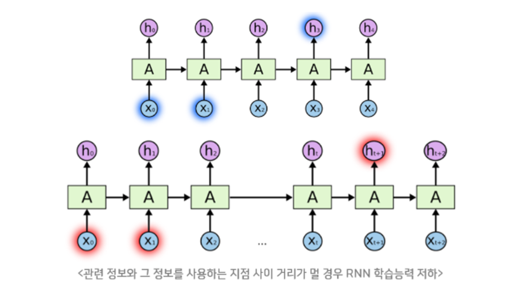
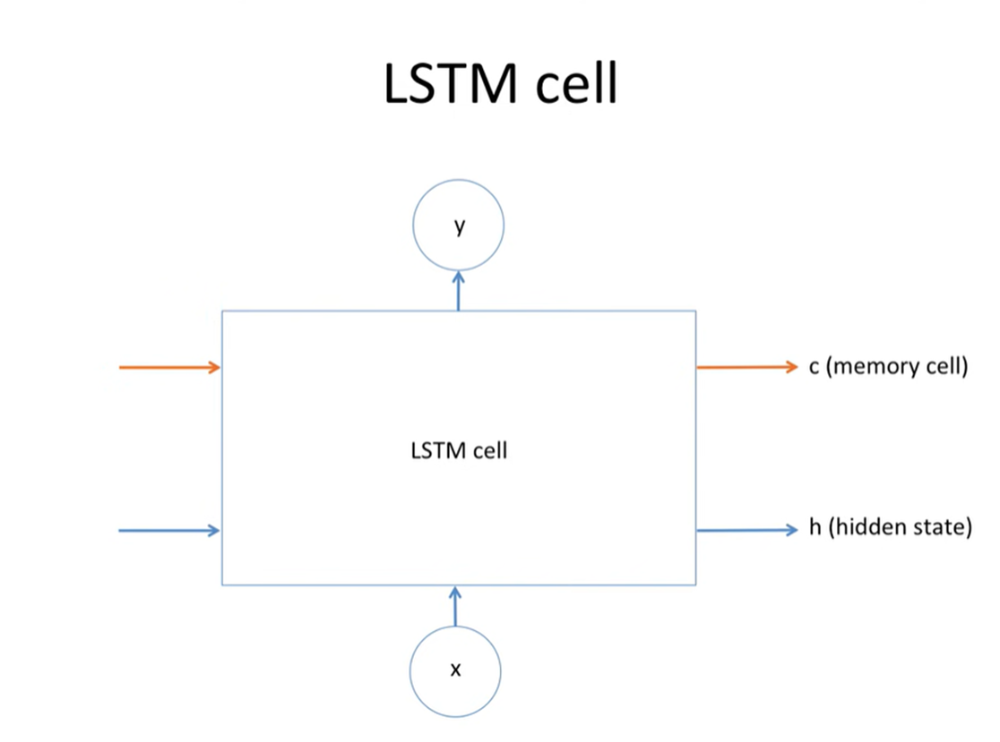

```python
import torch
import torch.optim as optim
import numpy as np
import matplotlib.pyplot as plt

# Random seed to make results deterministic and reproducible
torch.manual_seed(0)

# scaling function for input data
def minmax_scaler(data):
    numerator = data - np.min(data, 0)
    denominator = np.max(data, 0) - np.min(data, 0)
    return numerator / (denominator + 1e-7)


# make dataset to input
def build_dataset(time_series, seq_length):
    dataX = []
    dataY = []
    for i in range(0, len(time_series) - seq_length):
        _x = time_series[i:i + seq_length, :]
        _y = time_series[i + seq_length, [-1]]  # Next close price
        print(_x, "->", _y)
        dataX.append(_x)
        dataY.append(_y)
    return np.array(dataX), np.array(dataY)
```
```
# hyper parameters
seq_length = 7
data_dim = 5
hidden_dim = 10
output_dim = 1
learning_rate = 0.01
iterations = 500
```
> 데이터 설명


> 모델 구조

```python
# load data
xy = np.loadtxt("data-02-stock_daily.csv", delimiter=",")
xy = xy[::-1]  # reverse order

# split train-test set
train_size = int(len(xy) * 0.7)
train_set = xy[0:train_size]
test_set = xy[train_size - seq_length:]

# scaling data
train_set = minmax_scaler(train_set)
test_set = minmax_scaler(test_set)

# make train-test dataset to input
trainX, trainY = build_dataset(train_set, seq_length)
testX, testY = build_dataset(test_set, seq_length)

# convert to tensor
trainX_tensor = torch.FloatTensor(trainX)
trainY_tensor = torch.FloatTensor(trainY)

testX_tensor = torch.FloatTensor(testX)
testY_tensor = torch.FloatTensor(testY)
```

```python
class Net(torch.nn.Module):
    def __init__(self, input_dim, hidden_dim, output_dim, layers):
        super(Net, self).__init__()
        self.rnn = torch.nn.LSTM(input_dim, hidden_dim, num_layers=layers, batch_first=True)
        self.fc = torch.nn.Linear(hidden_dim, output_dim, bias=True)

    def forward(self, x):
        x, _status = self.rnn(x)
        x = self.fc(x[:, -1])
        return x


net = Net(data_dim, hidden_dim, output_dim, 1)
# loss & optimizer setting
criterion = torch.nn.MSELoss()
optimizer = optim.Adam(net.parameters(), lr=learning_rate)  
# start training
for i in range(iterations):

    optimizer.zero_grad()
    outputs = net(trainX_tensor)
    loss = criterion(outputs, trainY_tensor)
    loss.backward()
    optimizer.step()
    print(i, loss.item())
```

### Sequence Data에 대해
- 순서가 달라질 경우 의미가 손상되는 데이터
- **순서가 의미 있는 데이터**
- Ex) DNA 염기 서열, 기온 변화, 소리 신호, 주가, 환율, 번역



파라미터 갯수
W_xh (입력에서 히든 레이어로 가는 가중치):
입력 레이어의 차원은 4이고, 히든 레이어의 차원은 3입니다. 4×3=12

W_hh (히든 레이어에서 히든 레이어로 가는 가중치):
히든 레이어의 차원은 3이므로, W_hh의 가중치 개수는 3×3=9

W_hy (히든 레이어에서 출력 레이어로 가는 가중치):
히든 레이어의 차원은 3이고, 출력 레이어의 차원은 4입니다.3×4=12

### RNN 적용
- Speech Recognition

- Machine Translation

- Conversation Modeling, Question Answering

- Image and Video Captioning

운동을 열심히 하면 [???]이/가 늘어난다.
1.근육
2.지방
3.스트레스

**Bidirectional RNN**


**LSTM**



    

<video controls src="LSTM-1.mp4" title="Title"></video>